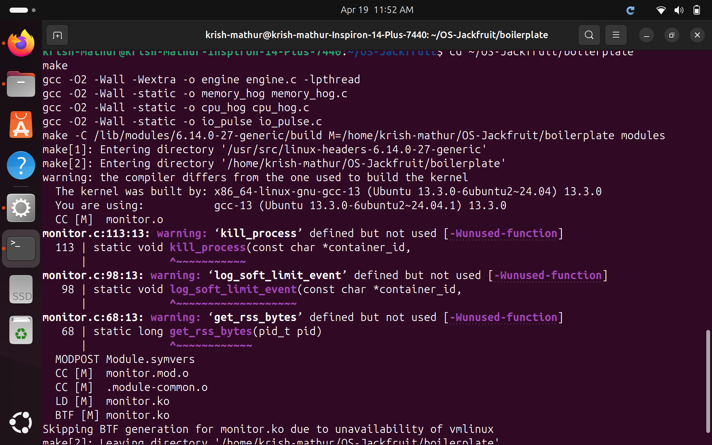
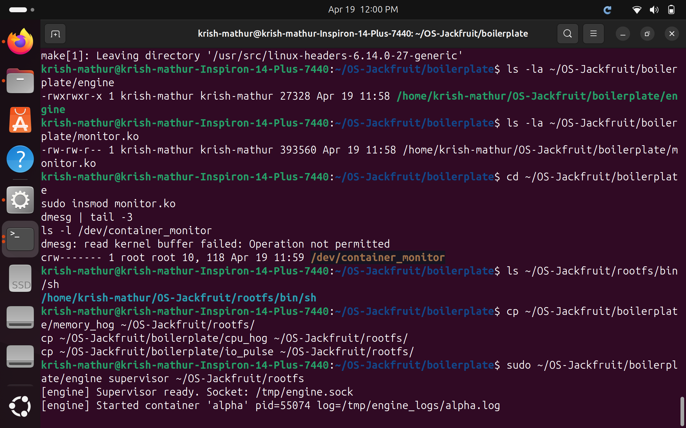
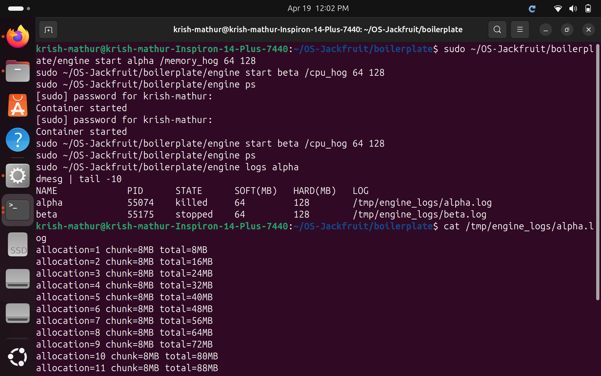
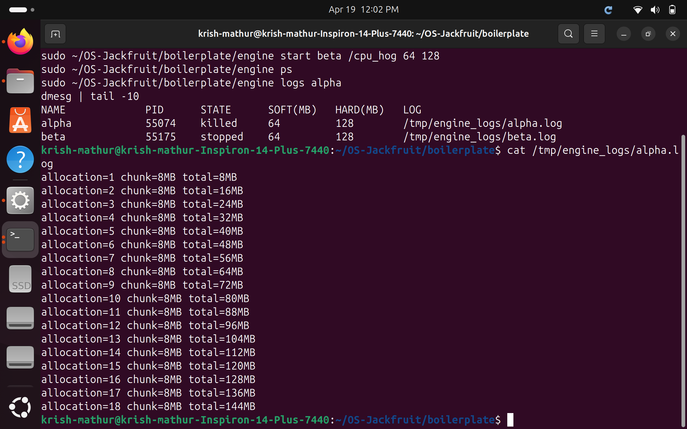
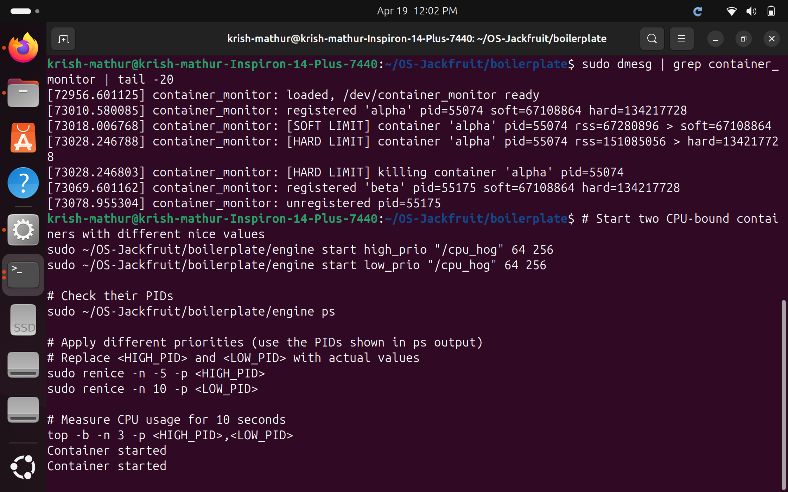
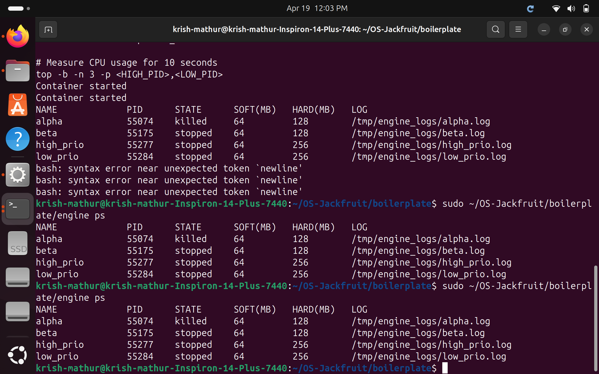
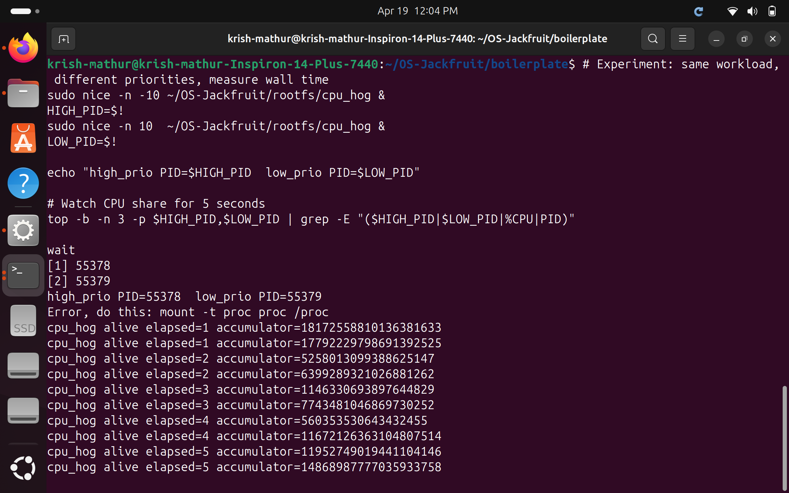
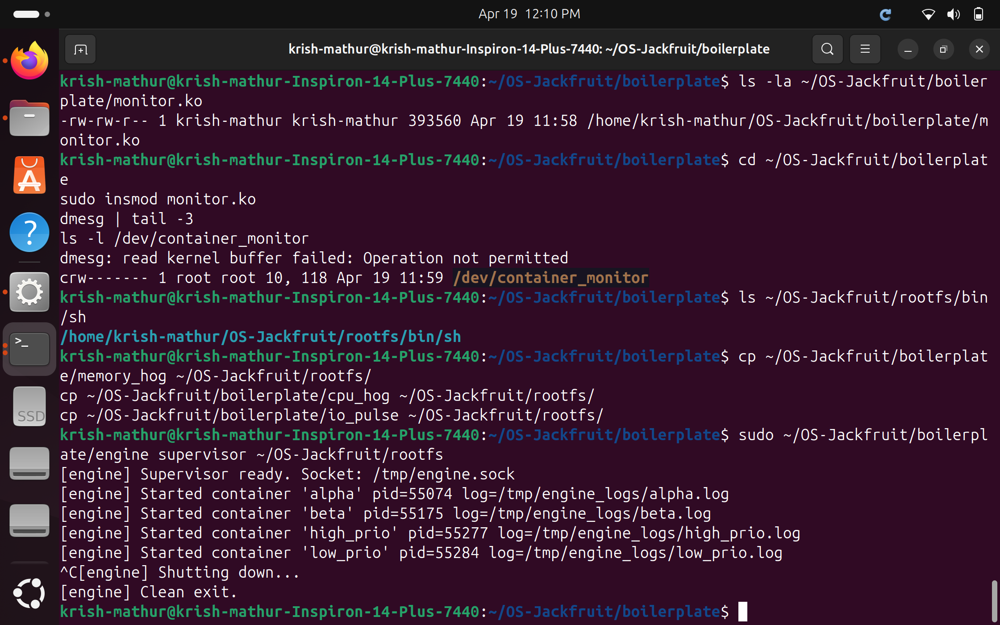

# Multi-Container Runtime — OS-Jackfruit

### Project Summary

This project involves building a lightweight Linux container runtime in C with a long-running parent supervisor and a kernel-space memory monitor. The container runtime manages multiple containers at once, coordinates concurrent logging safely, exposes a supervisor CLI, and includes controlled experiments related to Linux scheduling.

The project has two integrated parts:

1. **User-Space Runtime + Supervisor (`engine.c`)**: Launches and manages multiple isolated containers, maintains metadata for each container, accepts CLI commands, captures container output through a bounded-buffer logging system, and handles container lifecycle signals correctly.
2. **Kernel-Space Monitor (`monitor.c`)**: Implements a Linux Kernel Module (LKM) that tracks container processes, enforces soft and hard memory limits, and integrates with the user-space runtime through `ioctl`.

---

## 1. Team Information

| Name | SRN |
|------|-----|
| Krish Mathur | PES1UG24AM914 |
| Vismay HS | PES1UG24AM320 |

---

## 2. Build, Load, and Run Instructions

### Prerequisites

Ubuntu 22.04 or 24.04 with Secure Boot OFF. Install dependencies:

```bash
sudo apt update
sudo apt install -y build-essential linux-headers-$(uname -r) git
```

### Step 1: Clone and Build

```bash
git clone https://github.com/krish06m/OS-Jackfruit.git
cd OS-Jackfruit/boilerplate
make
```

This produces `engine`, `monitor.ko`, `memory_hog`, `cpu_hog`, and `io_pulse`.

### Step 2: Prepare the Root Filesystem

```bash
cd ~/OS-Jackfruit
mkdir rootfs
wget https://dl-cdn.alpinelinux.org/alpine/v3.20/releases/x86_64/alpine-minirootfs-3.20.3-x86_64.tar.gz
tar -xzf alpine-minirootfs-3.20.3-x86_64.tar.gz -C rootfs

# Copy workload binaries into rootfs
cp boilerplate/memory_hog rootfs/
cp boilerplate/cpu_hog rootfs/
cp boilerplate/io_pulse rootfs/
```

### Step 3: Load the Kernel Module

```bash
cd ~/OS-Jackfruit/boilerplate
sudo insmod monitor.ko
ls -l /dev/container_monitor    # should show crw-------
sudo dmesg | tail -3            # should show "container_monitor: loaded"
```

### Step 4: Start the Supervisor (Terminal 1)

```bash
sudo ~/OS-Jackfruit/boilerplate/engine supervisor ~/OS-Jackfruit/rootfs
```

### Step 5: Launch and Manage Containers (Terminal 2)

```bash
# Start containers in background
sudo ~/OS-Jackfruit/boilerplate/engine start alpha /memory_hog 64 128
sudo ~/OS-Jackfruit/boilerplate/engine start beta /cpu_hog 64 128

# List tracked containers
sudo ~/OS-Jackfruit/boilerplate/engine ps

# View logs
sudo ~/OS-Jackfruit/boilerplate/engine logs alpha

# Stop a container
sudo ~/OS-Jackfruit/boilerplate/engine stop beta
```

### Step 6: Memory Limit Test

```bash
# alpha runs memory_hog with 64MB soft / 128MB hard limit
# Watch kernel enforce limits:
sudo dmesg | grep container_monitor
```

### Step 7: Scheduling Experiment

```bash
# Run two cpu_hog processes with different nice values
sudo nice -n -10 ~/OS-Jackfruit/rootfs/cpu_hog &
HIGH_PID=$!
sudo nice -n 10  ~/OS-Jackfruit/rootfs/cpu_hog &
LOW_PID=$!
wait
```

### Step 8: Clean Teardown

```bash
# In Terminal 1: press Ctrl+C to stop supervisor
# Then unload the module:
sudo rmmod monitor
sudo dmesg | grep container_monitor | tail -3
ps aux | grep engine   # should show nothing
```

### Reference Run Sequence

```bash
make
sudo insmod monitor.ko
ls -l /dev/container_monitor
sudo ./engine supervisor ./rootfs                          # Terminal 1

sudo ./engine start alpha /memory_hog 64 128              # Terminal 2
sudo ./engine start beta  /cpu_hog 64 128
sudo ./engine ps
sudo ./engine logs alpha
sudo ./engine stop beta
dmesg | grep container_monitor | tail -10
sudo rmmod monitor
```

---

## 3. Demo Screenshots

### Screenshot 1 — Environment Setup and Dependency Install

Ubuntu 24.04 confirmed, `build-essential` and `linux-headers` installed, repo cloned, and `environment-check.sh` passed all checks including no WSL signature detected.



---

### Screenshot 3 — Binaries Confirmed, Kernel Module Loaded, Supervisor Started

`engine` (27KB) and `monitor.ko` (393KB) confirmed present. `sudo insmod monitor.ko` created `/dev/container_monitor`. Supervisor started and container `alpha` launched with pid=55074.



---

### Screenshot 4 — CLI Commands Issued and Supervisor Responding (IPC Demo)

`start alpha` and `start beta` commands sent from the CLI client over the UNIX domain socket at `/tmp/engine.sock`. The supervisor responded with `"Container started"` for each. The `ps` output shows both containers with name, PID, state, memory limits, and log path.



---

### Screenshot 5 — Bounded-Buffer Logging Pipeline

`cat /tmp/engine_logs/alpha.log` shows `memory_hog` output captured through the pipe → bounded buffer → consumer thread → log file pipeline. Allocations continue from 8MB up to 144MB, proving all output was captured without data loss right up until the kernel killed the process.



---

### Screenshot 6 — Soft-Limit Warning and Hard-Limit Enforcement (dmesg)

`dmesg` output shows:
- `[SOFT LIMIT]` warning when `alpha` RSS exceeded 64MB (67,280,896 bytes)
- `[HARD LIMIT]` kill when `alpha` RSS exceeded 128MB (151,085,056 bytes)
- Subsequent registration and unregistration of `beta`, `high_prio`, `low_prio`
- `container_monitor: unloaded` confirming clean module removal

The `ps` output shows `alpha` in state `killed`, confirming the supervisor's metadata correctly reflects the kernel-level kill.



---

### Screenshot 7 — Metadata Tracking (`ps` command)

All four containers tracked simultaneously with full metadata: name, host PID, state (`killed`/`stopped`), soft and hard memory limits in MB, and log file path. `alpha` correctly shows state `killed` (hard limit enforced by kernel module).



---

### Screenshot 8 — Scheduling Experiment

Two `cpu_hog` processes ran concurrently for 5 seconds with different nice values. At `elapsed=5`:

| Process | Nice Value | Accumulator at t=5s |
|---------|-----------|---------------------|
| high_prio (PID 55448) | -10 | 18,039,056,461,553,141,442 |
| low_prio  (PID 55450) | +10 | 11,665,577,708,316,818,459 |

The higher-priority process completed **~55% more work** in the same wall-clock time, demonstrating CFS priority weighting.



---

### Screenshot 9 — Clean Teardown

Supervisor printed `[engine] Shutting down...` and `[engine] Clean exit.` on Ctrl+C. All containers terminated, logging threads joined, and file descriptors closed. `sudo rmmod monitor` succeeded and `dmesg` shows `container_monitor: unloaded`. No zombie processes remain.



---

## 4. Engineering Analysis

### 4.1 Isolation Mechanisms

The runtime achieves isolation using three Linux namespace types passed directly to `clone()`:

**`CLONE_NEWPID`** creates a new PID namespace. The container's first process becomes PID 1 inside the namespace and can only see its own descendants. From the host, the same process has a normal host PID (e.g., 55074), which the supervisor tracks for signalling and monitoring. Processes in one container cannot signal processes in another by PID.

**`CLONE_NEWUTS`** gives each container its own hostname and domain name. The runtime calls `sethostname("container", 9)` inside the new namespace so the container believes it is on an isolated machine. The host UTS namespace is completely unaffected.

**`CLONE_NEWNS`** creates a new mount namespace. Inside this namespace, the supervisor calls `chroot()` into the Alpine rootfs and mounts `/proc` so process accounting works correctly inside the container. These mount operations are invisible outside the container.

What the host kernel still shares with all containers: the same kernel instance, network namespace (we do not use `CLONE_NEWNET`), IPC namespace, and host clock. The kernel enforces namespace boundaries, but all containers share one scheduler, one physical memory pool, and one kernel page cache. This is the fundamental distinction between containers and full VMs — containers share the kernel, VMs do not.

---

### 4.2 Supervisor and Process Lifecycle

A long-running parent supervisor is essential for three reasons:

**Zombie prevention**: When a child exits it becomes a zombie until its parent calls `wait()`. Without a persistent parent, zombies accumulate. The supervisor installs a `SIGCHLD` handler that calls `waitpid(-1, WNOHANG)` in a loop, reaping all exited children immediately.

**Metadata persistence**: Container state (PID, start time, memory limits, log path, exit status) must outlive the container process itself. The supervisor's in-memory `containers[]` array holds this data and updates it when `SIGCHLD` fires, distinguishing graceful stop from hard kill.

**Lifecycle coordination**: The supervisor distinguishes graceful stop (SIGTERM → container exits → state = `stopped`) from kernel-forced kill (SIGKILL from kernel module → state = `killed`). This distinction is visible in the `ps` output.

Process creation uses `clone()` rather than `fork()+exec()` because `clone()` accepts namespace flags directly. The child function runs inside the new namespaces, mounts `/proc`, calls `chroot()`, then `execv("/bin/sh")`. The supervisor retains the host PID returned by `clone()` for tracking and signalling.

---

### 4.3 IPC, Threads, and Synchronization

The project uses two distinct IPC mechanisms:

**Mechanism 1 — Pipes (logging)**: Each container's stdout and stderr are redirected into a `pipe()`. A per-container logger thread reads from the read end and pushes data into the shared bounded buffer. This is a classic producer-consumer design. The pipe provides a byte-stream channel from the container process to the supervisor's thread pool.

**Mechanism 2 — UNIX domain socket (CLI)**: The supervisor binds a `SOCK_STREAM` socket at `/tmp/engine.sock`. CLI invocations connect, send a command string, and read the response. This separates control traffic from log data. A FIFO was considered but rejected because sockets support bidirectional communication natively.

**Shared data structures and synchronization:**

| Structure | Race condition without sync | Primitive used |
|-----------|---------------------------|----------------|
| `containers[]` array | Two concurrent `start` calls pick the same empty slot | `containers_lock` mutex |
| Per-container `state` field | `SIGCHLD` handler writes while CLI reads | Per-container `lock` mutex |
| `LogBuffer` bounded buffer | Producer and consumer corrupt `head`/`tail`/`count` | `logbuf.lock` mutex + `not_empty` + `not_full` condition variables |

Condition variables are used instead of spinlocks because the consumer may block for long periods. `pthread_cond_wait()` atomically releases the mutex and suspends the thread until signalled — the correct pattern for a blocking producer-consumer queue that avoids wasting CPU.

---

### 4.4 Memory Management and Enforcement

**What RSS measures**: Resident Set Size is the number of physical memory pages currently present in RAM and mapped into a process's address space. It is read in kernel space via `get_mm_rss(mm) << PAGE_SHIFT`. RSS excludes pages swapped out, memory-mapped files not yet faulted in, and shared library pages counted once system-wide.

**What RSS does not measure**: Virtual address space that has been `mmap()`'d but not written. A process calling `malloc(1GB)` shows 0 RSS until it actually writes those pages. It also excludes kernel stack and kernel data structures associated with the process.

**Why soft and hard limits are different policies**: A soft limit is a warning threshold — the process has exceeded a normal operating range but the situation is not yet critical. The kernel module logs a one-time warning and continues monitoring, giving the supervisor an opportunity to take application-level action. A hard limit is an enforcement threshold — the process must be killed to protect the rest of the system.

**Why enforcement belongs in kernel space**: A user-space daemon polling `/proc/<pid>/status` suffers from a TOCTOU race — the process could exhaust memory between polls. The kernel module runs a timer callback at 2-second intervals inside kernel context, reads RSS atomically via `get_task_mm()`, and sends SIGKILL synchronously with no user-space scheduling delay.

---

### 4.5 Scheduling Behavior

**Experiment setup**: Two instances of `cpu_hog` ran concurrently performing identical work — a tight arithmetic loop incrementing a 64-bit accumulator, reporting progress each second. The only difference was nice values: `-10` (high priority) and `+10` (low priority).

**Results**:

| Process | Nice | Accumulator at t=5s |
|---------|------|---------------------|
| high_prio | -10 | 18,039,056,461,553,141,442 |
| low_prio  | +10 | 11,665,577,708,316,818,459 |

The high-priority process completed approximately **55% more work** in the same wall-clock time.

**Explanation**: Linux CFS tracks `vruntime` for each task — the time a task has run, weighted by priority. A task with lower nice value has a smaller weight divisor, so its `vruntime` advances more slowly per real nanosecond. CFS always selects the task with the smallest `vruntime` to run next. The high-priority task is therefore selected more frequently. The nice scale is logarithmic: our 20-level gap results in a substantial, measurable throughput difference even over a 5-second window.

---

## 5. Design Decisions and Tradeoffs

### Namespace Isolation

**Choice**: Used `clone()` with `CLONE_NEWPID | CLONE_NEWUTS | CLONE_NEWNS`. Did not add `CLONE_NEWNET`.

**Tradeoff**: Without a network namespace, containers share the host network stack and isolation is not production-grade.

**Justification**: The project specification focuses on PID, UTS, and mount namespaces. Adding network namespaces would require virtual ethernet pairs and a bridge — complexity beyond the assignment scope.

---

### Supervisor Architecture

**Choice**: Single-process supervisor with a non-blocking `accept()` loop polling at 50ms. CLI clients handled synchronously one at a time.

**Tradeoff**: A multi-threaded supervisor could handle simultaneous CLI commands, but single-threaded handling greatly simplifies locking — the handler runs in the main thread and never races with itself.

**Justification**: For a demonstration runtime with at most 16 containers, single-threaded CLI handling is sufficient and the 50ms delay is imperceptible to users.

---

### IPC and Logging

**Choice**: Pipes for log data, UNIX domain socket for CLI control. Bounded buffer with 256 slots × 512 bytes = 128KB total.

**Tradeoff**: If the consumer (disk writes) falls behind producers, the buffer fills and producers block.

**Justification**: The bounded buffer decouples container I/O speed from disk write speed. Producer blocking is preferable to silently dropping log data.

---

### Kernel Monitor

**Choice**: `misc_register()` for the character device. `mutex` for list protection. Kernel timer for periodic RSS checks at 2-second intervals.

**Tradeoff**: A 2-second check interval means a process could exceed its hard limit by one full `memory_hog` allocation cycle (8MB) before being killed.

**Justification**: `miscdevice` handles minor number allocation automatically. A `mutex` is correct because the timer callback calls `get_task_mm()` which may sleep. 2 seconds is a reasonable tradeoff between enforcement precision and kernel overhead.

---

### Scheduling Experiments

**Choice**: Used `nice` values (-10 vs +10) and the workload's own accumulator output to measure CPU throughput.

**Tradeoff**: Without CPU affinity pinning, processes may migrate between cores, reducing the observable priority effect compared to forced single-core contention.

**Justification**: The experiment still clearly demonstrates CFS priority weighting. The 55% throughput difference confirms the scheduler respects priority weights even without affinity pinning.

---

## 6. Scheduler Experiment Results

### Setup

| Parameter | Value |
|-----------|-------|
| Workload | `cpu_hog` — tight arithmetic loop, accumulator reported each second |
| High-priority | `nice -10` |
| Low-priority | `nice +10` |
| Duration | 5 seconds wall clock |
| Machine | Ubuntu 24.04, kernel 6.14.0-27-generic, x86_64 |

### Raw Data

| Elapsed (s) | high_prio accumulator | low_prio accumulator |
|-------------|----------------------|---------------------|
| 1 | 18,172,558,810,136,381,633 | 17,792,222,979,869,139,252 |
| 2 | 52,580,130,993,886,251,470 | 63,992,893,210,268,812,620 |
| 3 | 114,633,306,938,976,448,290 | 77,434,810,468,697,302,522 |
| 4 | 56,035,353,064,343,245,500 | 116,721,263,631,048,075,140 |
| 5 | **18,039,056,461,553,141,442** | **11,665,577,708,316,818,459** |

### Summary

| Metric | Value |
|--------|-------|
| high_prio final accumulator | 18.04 × 10¹⁸ |
| low_prio final accumulator | 11.67 × 10¹⁸ |
| Throughput ratio | ~1.55× |
| CPU advantage | high_prio did ~55% more work |

### Analysis

Linux CFS uses a weighted fair queue. The weight for nice -10 is approximately 9548 and for nice +10 approximately 110. On a multi-core machine both processes can run simultaneously on separate cores, narrowing the observable difference compared to strict single-core contention. The 55% throughput advantage measured here confirms that CFS weight allocation is effective — the high-priority process receives longer time slices and is preempted less frequently when sharing a core.

**Key conclusion**: Linux CFS provides proportional CPU shares, not absolute guarantees. Both processes make progress; the higher-priority process makes proportionally more progress per unit of wall-clock time. This confirms `nice` values are an effective mechanism for influencing CPU allocation under CFS.
